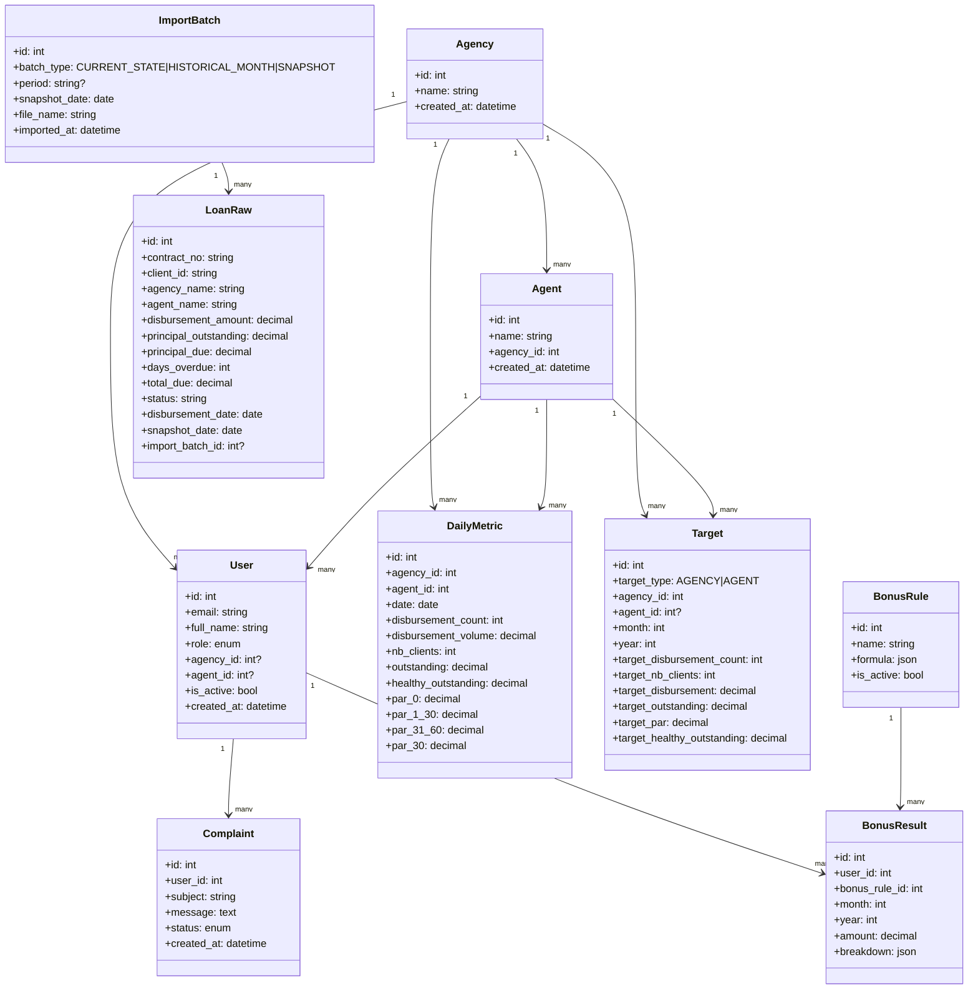

# Architecture

MicroCred is organized around immutable daily snapshots and import batches.

## Data Flow

1. A user uploads the Excel end-of-day loan file.
2. The import service validates required columns and row values.
3. If importing `CURRENT_STATE`:
   - previous `CURRENT_STATE` batches are archived as `SNAPSHOT` (or replaced if same `DateEOD`).
   - the new file becomes the single active `CURRENT_STATE`.
4. If importing `HISTORICAL_MONTH`:
   - snapshots from the same month are removed automatically.
   - the historical monthly closure file is saved for that period.
5. Rows are inserted into `loans_raw` using `(contract_no, snapshot_date)` as uniqueness boundary.
6. KPI aggregation runs for the imported snapshot date.
7. Aggregated rows are stored in `daily_metrics` per agency, agent, and date.
8. Dashboards, target comparisons, reports, and bonus calculations read from scoped data.

## Core Rule

Raw loan data and daily metrics are separate. Aggregates are recalculated idempotently from the imported raw batch. Dashboard comparisons use explicit batch origins (`CURRENT_STATE`, `HISTORICAL_MONTH`, selected `SNAPSHOT`) without mixing data across batches.

## Modules

- `app/api`: API routers and request handling
- `app/core`: settings, logging, security
- `app/db`: database session and base metadata
- `app/models`: SQLAlchemy models
- `app/schemas`: Pydantic schemas
- `app/services`: import, KPI, bonus, reporting business logic

## Database Class Diagram

